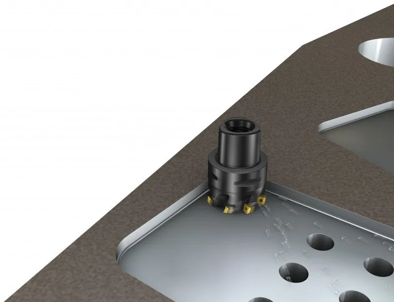

# CLI API Docs

This file is generated from the current CLI entrypoints.
Regenerate with:

```bash
make docs-cli
```

## Main Commands

- `run`: Launch the CNC-DFM checker (opens STEP picker if no file passed)
- `run /path/to/part.step`: Run checker on a specific file
- `run config`: Interactive setup wizard for R1-R5 thresholds
- `run show-config`: Show saved threshold config currently used by `run`

## Checker CLI (src/dfm_check.py --help)

```text
usage: dfm_check.py [-h] [--min-radius MIN_RADIUS]
                    [--max-pocket-ratio MAX_POCKET_RATIO]
                    [--min-wall MIN_WALL] [--max-hole-ratio MAX_HOLE_RATIO]
                    [--max-setups MAX_SETUPS]
                    step_file

CLI DFM checker for STEP files (pythonOCC).

positional arguments:
  step_file             Path to input STEP file

options:
  -h, --help            show this help message and exit
  --min-radius MIN_RADIUS
                        Rule 1 min internal radius (mm)
  --max-pocket-ratio MAX_POCKET_RATIO
                        Rule 2 max pocket depth ratio
  --min-wall MIN_WALL   Rule 3 min wall thickness (mm)
  --max-hole-ratio MAX_HOLE_RATIO
                        Rule 4 max hole depth/diameter ratio
  --max-setups MAX_SETUPS
                        Rule 5 max setup faces/axes
```

## Config CLI (src/dfm_config.py --help)

```text
usage: dfm_config.py [-h] [--wizard] [--print-args] [--show]

CNC-DFM config manager

options:
  -h, --help    show this help message and exit
  --wizard      Run interactive setup
  --print-args  Print saved config as CLI args
  --show        Show current saved config
```

## Persistent Config

- Default path: `/Users/eoincobbe/dev/cnc-dfm/cache/dfm_config.json`
- Override path with env var: `CNC_DFM_CONFIG_PATH`
